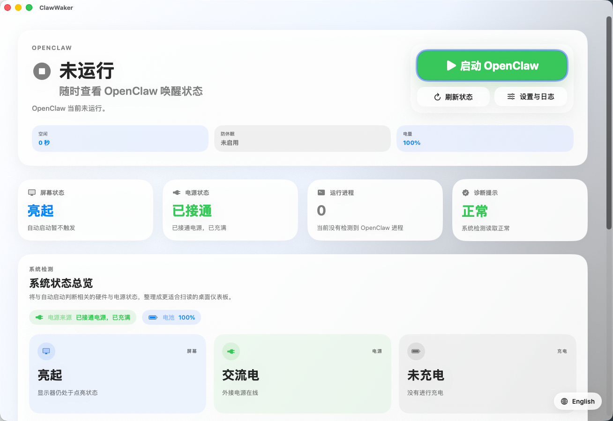

# ClawWaker

**离开工位，自动启动 OpenClaw**

[English](./README_EN.md) · **简体中文**

---

## 简体中文

### 为什么需要它？

你只有一台工作电脑。日常使用时，OpenClaw 占用资源是个负担。但当你离开工位或下班回家，又需要它持续运行。

**ClawWaker 让这一切自动发生。**

### 工作原理

当以下条件**同时满足**时，自动启动 OpenClaw：

| 条件 | 说明 |
|:-----|:-----|
| 屏幕关闭 | 你已离开显示器前 |
| 电源接通 | 确保稳定供电 |
| 60 秒无输入 | 确认你真的离开了 |

当任一条件被打破（屏幕点亮、键鼠输入、电源断开），自动停止 OpenClaw。

之后，你可以通过飞书或 Telegram 远程控制它。

### 功能特性

- **状态监控** — 实时显示 OpenClaw 运行状态
- **自动化规则** — 离开工位自动启动，回来自动停止
- **安全停止** — 仅停止由本应用启动的实例，不影响手动启动的服务
- **菜单栏驻留** — 关闭窗口后继续在后台工作
- **防休眠辅助** — 黑屏状态下保持设备可达
- **多语言支持** — 中文 / English

### 快速开始

1. 下载并打开 ClawWaker
2. 在设置中配置 OpenClaw 的启动/停止命令
3. 保持应用运行
4. 离开工位，接上电源，关闭屏幕 — 完成

### 注意事项

> **合盖休眠**：macOS 的合盖硬件休眠策略无法被应用层绕过。如需合盖使用，请外接显示器和键鼠。

### 项目信息

- **版本**：0.1.1
- **平台**：macOS
- **仓库**：[github.com/bigbigtooth/ClawWaker](https://github.com/bigbigtooth/ClawWaker)

---

**[反馈问题](https://github.com/bigbigtooth/ClawWaker/issues) · [功能建议](https://github.com/bigbigtooth/ClawWaker/issues)**

如果这个工具对你有帮助，欢迎 Star ⭐

