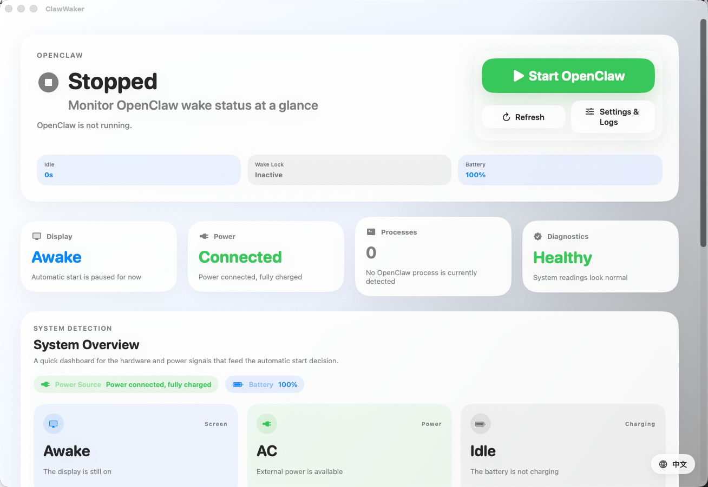

# ClawWaker

**Auto-manage OpenClaw when you step away from your Mac**

[**English**](./README_EN.md) · [简体中文](./README.md)

---

## Why ClawWaker?

You have one work computer. Running OpenClaw consumes resources while you're using it, but you need it active when you step away — whether for a quick break or after heading home.

**ClawWaker automates this transition.**

## How It Works

OpenClaw starts automatically when **all** conditions are met:

| Condition | Description |
|:----------|:------------|
| Display off | You've left the screen |
| Power connected | Stable power supply ensured |
| No input for 60s | Confirmed absence |

When any condition breaks — display turns on, input is detected, or power disconnects — ClawWaker automatically stops the OpenClaw instance it started.

Once running, you can control OpenClaw remotely via Feishu or Telegram.

## Features

- **Status Monitoring** — Real-time visibility of OpenClaw running state
- **Smart Automation** — Auto-start when away, auto-stop when back
- **Safe Shutdown** — Only stops instances started by ClawWaker; your manually launched services remain untouched
- **Menu Bar App** — Continues working in the background even when window is closed
- **Anti-Sleep Assist** — Keeps your Mac reachable while the screen is off
- **Localization** — Chinese / English support

## Quick Start

1. Download and launch ClawWaker
2. Configure OpenClaw start/stop commands in Settings
3. Keep the app running
4. Step away, plug in power, turn off screen — done

## Automation Rules

### Auto-Start Conditions
All three must be true:
- Display is off
- Power adapter connected
- No keyboard/mouse input for 60 seconds

### Auto-Stop Triggers
Any one triggers stop:
- Display turns on
- Keyboard or mouse input detected
- Power adapter disconnected

> **Note**: Auto-stop only applies to OpenClaw instances started by ClawWaker, preventing accidental termination of manually launched services.

## Important Notes

> **Lid Sleep**: macOS hardware sleep policy on lid close cannot be bypassed at the application level. If you need to use your Mac with the lid closed, connect an external display and keyboard/mouse.

## Project Info

- **Version**: 0.1.2
- **Platform**: macOS
- **Repository**: [github.com/bigbigtooth/ClawWaker](https://github.com/bigbigtooth/ClawWaker)

---

**[Report Bug](https://github.com/bigbigtooth/ClawWaker/issues) · [Request Feature](https://github.com/bigbigtooth/ClawWaker/issues)**

If this tool helps you, consider giving it a ⭐

